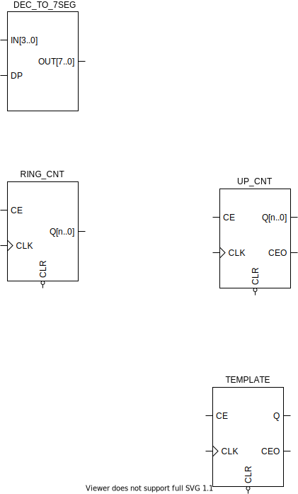

# AMSUC - Timer Project

## RTL Diagram

## Revisions:
### v1 
Dynamic 7seg display, support for 8 modules. Down counter, ring counter, converter hex to 7seg. 
Simple app that displays 10Hz down counter output.

## TODO:
- Tests of feat/timer-v1
- Buttons support
- Start / Stop support
- Clear support
- "State machine" for setting/operating mode
